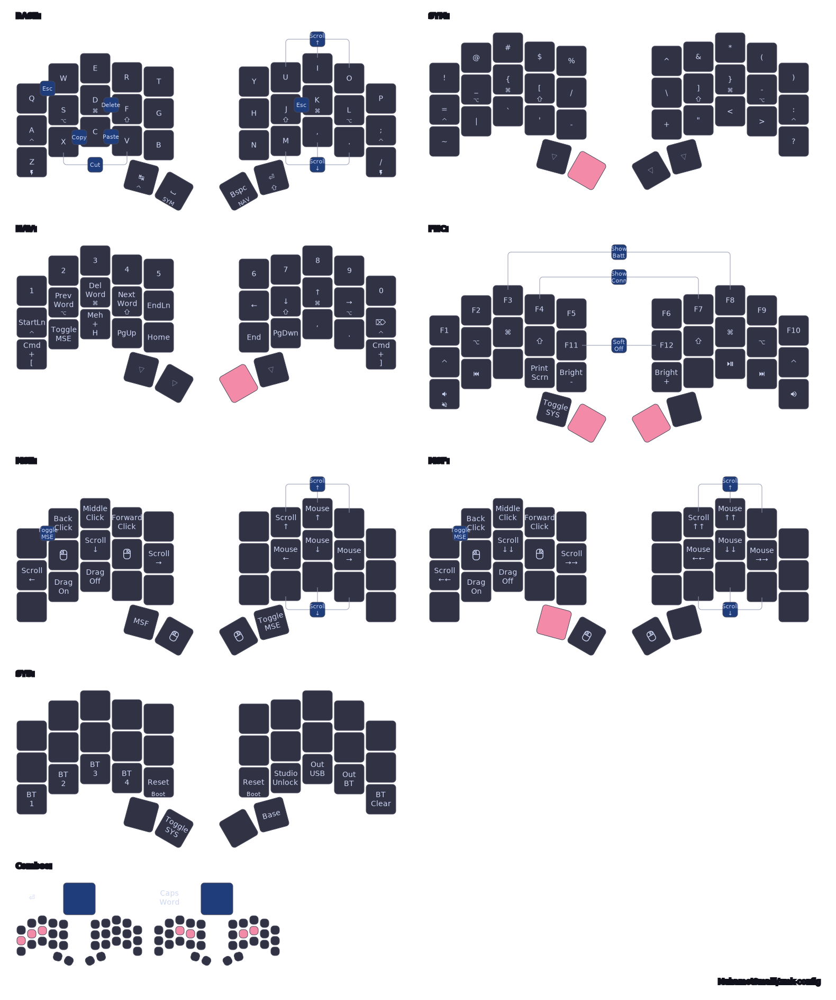

# 34-Key ZMK Layout (Sweep / Urchin / Forager)

| [Ferris Sweep](https://github.com/davidphilipbarr/Sweep)                                                                                  | 
| ----------------------------------------------------------------------------------------------------------------------------------------- | 
|  |

This repo contains my personal [ZMK](https://zmk.dev/) keymap for my key boards. This repo is a fork of [MSmaili's zmk config](https://github.com/MSmaili/zmk-config/tree/main), with some minor changes (just adapted to my keyboards and a few keymap tweaks to my preferences).

The logical layout is shared, while board-specific firmware targets and shields are handled in `build.yaml`.

## One Shared Keymap

Shared layout logic lives in `config/includes/`:

- `base.dtsi` for layers, hold-taps, and core behaviors
- `combos.dtsi` for combo definitions
- `mouse.dtsi` for mouse movement and scroll behavior

Changes in these files apply to all three boards (Sweep, Urchin, and Forager).

## Build Profiles and Flash Targets

Each keyboard supports two connection modes:

### Dongle mode

- `<keyboard>_dongle` -> flash to dongle
- `<keyboard>_left_peripheral` -> flash to left half
- `<keyboard>_right` -> flash to right half

### Dongleless mode

- `<keyboard>_left_central` -> flash to left half (central)
- `<keyboard>_right` -> flash to right half

## CI vs Local Builds

### CI (full matrix)

- GitHub Actions builds the full matrix from `build.yaml`, including all boards and both dongle + dongleless profiles.

### Local Docker (single board iteration)

- Use local Docker when you want to iterate on one board only.
- Build one board locally with `make build KEYBOARD=<sweep|urchin|forager>`.
- Build dongle profile locally with `make build KEYBOARD=<...> DONGLE=1`.
- Prerequisite: Docker daemon must be running.

```sh
make help

make build KEYBOARD=sweep
make build KEYBOARD=urchin
make build KEYBOARD=urchin DONGLE=1
make build KEYBOARD=forager

make draw KEYBOARD=sweep
make draw KEYBOARD=urchin
make draw KEYBOARD=forager
```

Notes:

- Local firmware builds read `build.yaml` directly, so board/shield/snippet/cmake options stay aligned with CI builds.
- Firmware output files are written to `build/local/`:
  - Dongleless (`DONGLE=0`): `build/local/<keyboard>_right.uf2`, `build/local/<keyboard>_left_central.uf2`
  - Dongle (`DONGLE=1`): `build/local/<keyboard>_left_peripheral.uf2`, `build/local/<keyboard>_right.uf2`, `build/local/<keyboard>_dongle.uf2`
- Keymap-drawer output files are written to `tools/keymap-drawer/`.
- First keymap draw builds a pinned local Docker image for keymap-drawer.

## How the Layout Works

### Layout philosophy

- The layout is intentionally close to standard QWERTY, so muscle memory still transfers well.
- Number keys stay on the top row, similar to a regular keyboard.
- The symbol layer also follows familiar top-row QWERTY positions where possible.
- Navigation follows Vim-like movement patterns.
- High-usage programming symbols are placed closer to home row for faster access (`{}`, `[]`, `_`, `-`, `=`, `:`).

### Layer model

- `BASE`: QWERTY + home-row mods
- `SYM`: symbols and punctuation in familiar QWERTY-style positions
- `NAV`: Vim-style navigation, number row, media, word navigation
- `FNC`: function keys, Bluetooth profile management, output switching, reset
- `MSE`: mouse movement, scroll, clicks, drag helpers
- `MSE_FAST`: faster temporary mouse/scroll behavior

`FNC` is also a tri-layer: it activates when both `SYM` and `NAV` are active.

### Core behavior choices

- Home-row mods are tuned with custom hold-tap settings for reliable mod/tap distinction.
- Thumb keys are used heavily for layer access and core keys (Space, Backspace, Tab, Enter).
- Common coding symbols are kept close to home row to reduce finger travel while programming.
- Combos are intentional and practical (defined in `config/includes/combos.dtsi`), including:
  - Editing: `Delete`, `Cut`, `Copy`, `Paste`
  - Control: `Escape` (including a left-hand escape combo), `Enter`, `Caps Word`
  - Navigation aid: fast scroll combos (`UIO` for up, `M,.` for down)
  - Utility (on `FNC`): `Soft Off`, battery/connection indicator combos

## Layer Map

<p align="center">

</p>

## Credits

- [urob/zmk-config](https://github.com/urob/zmk-config) for home-row mod philosophy and layout ideas
- [caksoylar/zmk-config](https://github.com/caksoylar/zmk-config) for layout structure and keymap-drawer integration
